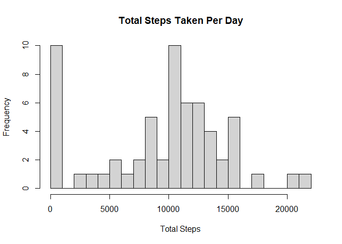
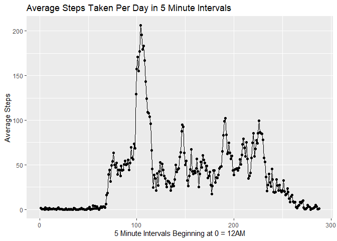
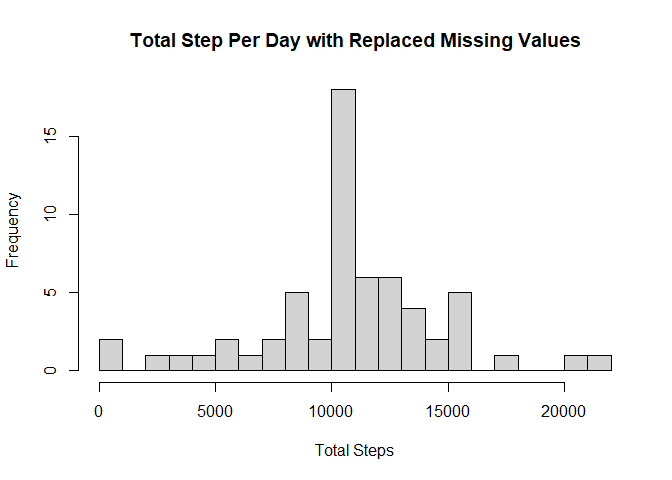
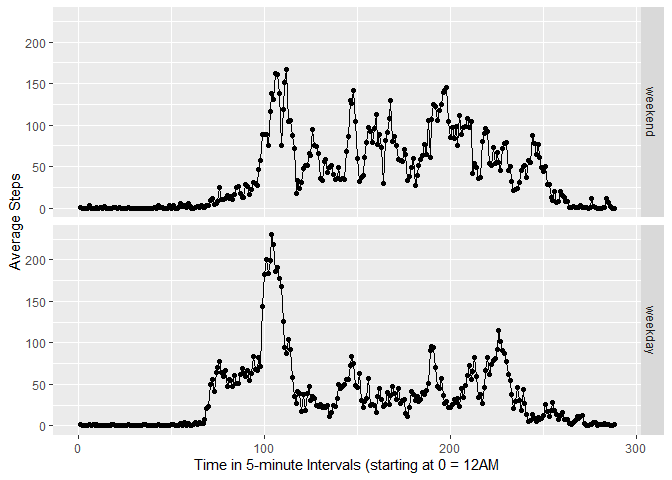

## **Loading and preprocessing the data**
### Load and look at the data format and structure.


```r
data <- read.table("activity 2.csv", header = TRUE, sep = ",")
head(data)
```

```
##   steps    date interval
## 1    NA 10/1/12        0
## 2    NA 10/1/12        5
## 3    NA 10/1/12       10
## 4    NA 10/1/12       15
## 5    NA 10/1/12       20
## 6    NA 10/1/12       25
```

```r
str(data)
```

```
## 'data.frame':	17568 obs. of  3 variables:
##  $ steps   : int  NA NA NA NA NA NA NA NA NA NA ...
##  $ date    : chr  "10/1/12" "10/1/12" "10/1/12" "10/1/12" ...
##  $ interval: int  0 5 10 15 20 25 30 35 40 45 ...
```
### Convert date column from factor to date.


```r
data$date <- as.Date(data$date, format = "%m/%d/%y")
str(data)
```

```
## 'data.frame':	17568 obs. of  3 variables:
##  $ steps   : int  NA NA NA NA NA NA NA NA NA NA ...
##  $ date    : Date, format: "2012-10-01" "2012-10-01" ...
##  $ interval: int  0 5 10 15 20 25 30 35 40 45 ...
```
## **What is the mean total number of steps taken per day?**
### 1. Calculate the total number of steps taken per day.

```r
library(dplyr)
```

```
## 
## Attaching package: 'dplyr'
```

```
## The following objects are masked from 'package:stats':
## 
##     filter, lag
```

```
## The following objects are masked from 'package:base':
## 
##     intersect, setdiff, setequal, union
```

```r
sum_data <- data %>% group_by(date) %>% 
  summarize(total = sum(steps, na.rm = TRUE))
```

```
## `summarise()` ungrouping output (override with `.groups` argument)
```

```r
head(sum_data)
```

```
## # A tibble: 6 x 2
##   date       total
##   <date>     <int>
## 1 2012-10-01     0
## 2 2012-10-02   126
## 3 2012-10-03 11352
## 4 2012-10-04 12116
## 5 2012-10-05 13294
## 6 2012-10-06 15420
```
### 2. Make a histogram of the total number of steps taken each day. 


```r
hist(sum_data$total, xlab = "Total Steps", main = "Total Steps Taken Per Day", 
     breaks = 25)
```

<!-- -->


### 3. Calculate and report the mean and median of the total number of steps
### taken per day. 


```r
summ_data <- sum_data %>%
  summarize(mean = mean(total, na.rm = TRUE), median = median(total, na.rm = TRUE))
head(summ_data)
```

```
## # A tibble: 1 x 2
##    mean median
##   <dbl>  <int>
## 1 9354.  10395
```

## **What is the Average Daily Activity Pattern**
### 1. Make a time series plot of the intervals and average steps taken

```r
data$interval <- as.factor(data$interval)
str(data)
```

```
## 'data.frame':	17568 obs. of  3 variables:
##  $ steps   : int  NA NA NA NA NA NA NA NA NA NA ...
##  $ date    : Date, format: "2012-10-01" "2012-10-01" ...
##  $ interval: Factor w/ 288 levels "0","5","10","15",..: 1 2 3 4 5 6 7 8 9 10 ...
```

```r
library(ggplot2)
TS_data <- data %>% group_by(interval) %>% summarize (mean = mean(steps, na.rm = TRUE))
```

```
## `summarise()` ungrouping output (override with `.groups` argument)
```

```r
head(TS_data)
```

```
## # A tibble: 6 x 2
##   interval   mean
##   <fct>     <dbl>
## 1 0        1.72  
## 2 5        0.340 
## 3 10       0.132 
## 4 15       0.151 
## 5 20       0.0755
## 6 25       2.09
```

```r
ggplot(TS_data, aes(as.numeric(interval), mean)) + 
  geom_point() + 
  geom_path() +
  xlab("5 Minute Intervals Beginning at 0 = 12AM") +
  ylab("Average Steps") +
  ggtitle("Average Steps Taken Per Day in 5 Minute Intervals")
```

<!-- -->


### 2. Which interval, on average across all days, contains the maximum number
### of steps?

```r
max <- TS_data[which.max(TS_data$mean),]
max
```

```
## # A tibble: 1 x 2
##   interval  mean
##   <fct>    <dbl>
## 1 835       206.
```
## **Imputing Missing Values**

### 1. Calculate and report the total number of NAs in the dataset.

```r
colSums(is.na(data))
```

```
##    steps     date interval 
##     2304        0        0
```
### 2.and 3.Replace NA values with the mean value across days during that interval and create a new data set including missing values filled in


```r
data_NA <- data %>% 
  group_by(interval) %>%
  mutate(steps_fill = ifelse(is.na(steps),
                             mean(steps, na.rm = TRUE), steps))

head(data_NA)
```

```
## # A tibble: 6 x 4
## # Groups:   interval [6]
##   steps date       interval steps_fill
##   <int> <date>     <fct>         <dbl>
## 1    NA 2012-10-01 0            1.72  
## 2    NA 2012-10-01 5            0.340 
## 3    NA 2012-10-01 10           0.132 
## 4    NA 2012-10-01 15           0.151 
## 5    NA 2012-10-01 20           0.0755
## 6    NA 2012-10-01 25           2.09
```
### 4a. Histogram showing total number of steps per day with avarage missing values

```r
sumNA_data <- data_NA %>% group_by(date) %>% 
  summarize(total = sum(steps_fill, na.rm = TRUE))
```

```
## `summarise()` ungrouping output (override with `.groups` argument)
```

```r
head(sumNA_data)
```

```
## # A tibble: 6 x 2
##   date        total
##   <date>      <dbl>
## 1 2012-10-01 10766.
## 2 2012-10-02   126 
## 3 2012-10-03 11352 
## 4 2012-10-04 12116 
## 5 2012-10-05 13294 
## 6 2012-10-06 15420
```

```r
hist(sumNA_data$total, xlab = "Total Steps", main = "Total Step Per Day with Replaced Missing Values",
     breaks = 25)
```

<!-- -->

### 4b.Mean and median steps per day

```r
summNA_data <- sumNA_data %>%
  summarize(mean = mean(total, na.rm = TRUE), median = median(total, na.rm = TRUE))
head(summNA_data)
```

```
## # A tibble: 1 x 2
##     mean median
##    <dbl>  <dbl>
## 1 10766. 10766.
```
## ** Are there differences in activity patterns between weekdays and weekends?**
### 1. Create a new factor variable in the dataseet with two levels

```r
data_NA$date <- as.Date(data_NA$date, format = "%m/%d/%y")
str(data)
```

```
## 'data.frame':	17568 obs. of  3 variables:
##  $ steps   : int  NA NA NA NA NA NA NA NA NA NA ...
##  $ date    : Date, format: "2012-10-01" "2012-10-01" ...
##  $ interval: Factor w/ 288 levels "0","5","10","15",..: 1 2 3 4 5 6 7 8 9 10 ...
```

```r
weekdays1 <- c('Monday', 'Tuesday', 'Wednesday', 'Thursday','Friday')
data_NA$days <- factor((weekdays(data_NA$date) %in% weekdays1), 
         levels=c(FALSE, TRUE), labels=c('weekend', 'weekday'))
head(data_NA)
```

```
## # A tibble: 6 x 5
## # Groups:   interval [6]
##   steps date       interval steps_fill days   
##   <int> <date>     <fct>         <dbl> <fct>  
## 1    NA 2012-10-01 0            1.72   weekday
## 2    NA 2012-10-01 5            0.340  weekday
## 3    NA 2012-10-01 10           0.132  weekday
## 4    NA 2012-10-01 15           0.151  weekday
## 5    NA 2012-10-01 20           0.0755 weekday
## 6    NA 2012-10-01 25           2.09   weekday
```
### 2. Make a panel plot. 


```r
summ_days <- data_NA %>% 
  group_by(interval, days) %>% 
  summarize(Average = mean(steps_fill))
```

```
## `summarise()` regrouping output by 'interval' (override with `.groups` argument)
```

```r
summ_days
```

```
## # A tibble: 576 x 3
## # Groups:   interval [288]
##    interval days    Average
##    <fct>    <fct>     <dbl>
##  1 0        weekend 0.215  
##  2 0        weekday 2.25   
##  3 5        weekend 0.0425 
##  4 5        weekday 0.445  
##  5 10       weekend 0.0165 
##  6 10       weekday 0.173  
##  7 15       weekend 0.0189 
##  8 15       weekday 0.198  
##  9 20       weekend 0.00943
## 10 20       weekday 0.0990 
## # ... with 566 more rows
```


```r
ggplot(summ_days, aes(as.numeric(interval), Average)) + 
  geom_point() + geom_path() +
  facet_grid(days ~ .) + xlab("Time in 5-minute Intervals (starting at 0 = 12AM") +
  ylab("Average Steps")
```

<!-- -->
